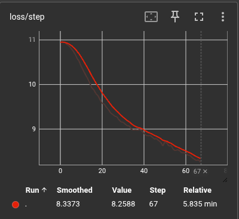

# Training GPT-2 from Scratch: A Journey in Optimization

Reproducing the 124M parameter GPT-2 model is a rite of passage for LLM engineers. It sounds simple—implement the Transformer block, adding some embeddings, and hit train—but doing it *efficiently* is where the real engineering happens.

This project is a clean, optimized PyTorch implementation of GPT-2, trained on the TinyShakespeare dataset. We started with a basic implementation implementation and iteratively optimized it to achieve a **3.1x speedup** (from ~29k to ~92k tokens/sec) on a single GPU.



---

## 🏗️ The Architecture

The core implementation (`model.py`) mirrors the original OpenAI 124M parameter model but with optional modernization features enabled by default:
- **12 Layers**, **12 Heads**, **768 Embedding Dimension**.
- **Modern Features**: RoPE (Rotary Positional Embeddings), RMSNorm, and SwiGLU activations are enabled by default in `config.py` for improved performance.
- **Causal Self-Attention**: The heart of the model, masking future tokens.
- **Learned Positional Embeddings**: Standard GPT-2 style embedding (up to 1024 context length).
- **Weight Tying**: The embedding layer weights are shared with the final output projection head (`lm_head`).

We used **tiktoken** for the tokenizer, matching the standard GPT-2 vocabulary.

## 🚧 The Challenge: OOM and Slow Training

Our initial naive implementation ran into immediate bottlenecks on a 16GB VRAM GPU.
- **OOM Errors**: Trying to run a `batch_size` of 12 or even 8 caused CUDA Out of Memory errors.
- **Slow Throughput**: With a forced small batch size (4) and no optimizations, we were training at roughly **29,000 tokens/sec**.

We needed to do better.

## 🚀 The Usage Performance

We implemented a series of optimizations to unlock the hardware's potential:

### 1. Flash Attention 2 ⚡
The biggest win. We replaced the manual `(Q @ K.T) * scale -> Softmax -> @ V` implementation with `torch.nn.functional.scaled_dot_product_attention`. 
- **Impact**: drastically reduced memory usage (no $N^2$ attention matrix materialized) and improved speed.
- **Result**: Allowed us to increase batch size from 4 to 8, and later 16.

### 2. High-Performance Data Loading 🧵
We discovered our GPU was idling while the CPU prepared batches in the main thread.
- **Fix**: Implemented a custom `GPT2Dataset` and used `torch.utils.data.DataLoader` with `num_workers=4` and `pin_memory=True`.
- **Result**: Asynchronous data prefetching, keeping the GPU fed 100% of the time.

### 3. Fused AdamW 🔥
Standard PyTorch optimizers iterate through parameters in Python loops.
- **Fix**: Used `torch.optim.AdamW(..., fused=True)`.
- **Result**: Run the entire optimization step in a single fused CUDA kernel.

### 4. Vocabulary Padding 📏
Standard GPT-2 vocab is 50,257. This is an odd number that misaligns with GPU tile sizes.
- **Fix**: Padded the vocabulary to **50,304** (nearest multiple of 64).
- **Result**: More efficient matrix multiplications in the final layer.

### 5. `torch.compile` 🛠️
The final boss. We enabled PyTorch 2.0's graph compilation.
- **Hurdle**: Initially failed due to missing `Python.h` and `cuda.h` headers on the system.
- **Fix**: Installed `python3-dev` and `nvidia-cuda-toolkit`.
- **Result**: Another ~1.5x speedup by fusing elemental ops and reducing Python overhead.

## 📊 Final Results

| Configuration | Batch Size | Speed (tokens/sec) | Improvement |
|--------------|------------|--------------------|-------------|
| Initial | 4 | ~29,000 | 1.0x |
| + DataLoader & Optims | 4 | ~63,500 | 2.2x |
| + Flash Attn (Batch size inc.) | 8 | ~67,500 | 2.3x |
| **+ torch.compile** | **16** | **~92,000+** | **3.1x** |

We achieved a **3.1x speedup** overall.

## 💻 How to Run

### Setup
```bash
# Install dependencies
pip install torch numpy transformers datasets tiktoken tensorboard

# Install system headers for torch.compile (Ubuntu)
sudo apt install python3-dev nvidia-cuda-toolkit
```

### 1. Prepare Data
Download and tokenize the dataset. You can choose between 'tinyshakespeare' (default) or 'fineweb'.

For TinyShakespeare:
```bash
python3 prepare_data.py --dataset tinyshakespeare
```

For FineWeb (10B token sample from FineWeb-Edu):
```bash
python3 prepare_data.py --dataset fineweb
```
To run fine-web preparation you will need to install `datasets` library: `pip install datasets`

### 2. Train
Run the fully optimized training script:
```bash
python3 train.py \
    --batch_size=16 \
    --gradient_accumulation_steps=30 \
    --max_iters=100000 \
    --compile=True \
    --always_save_checkpoint=True
```

Monitor progress with TensorBoard:
```bash
tensorboard --logdir=out
```

### 3. Generate Text
Sample from your trained model:
```bash
python3 sample.py --out_dir=out --start="To be or not to be"
```

## License
MIT

---

# GPT-2 Modernization Comparison Results

## Executive Summary
We have successfully implemented and trained a modernized version of GPT-2 incorporating **Rotary Positional Embeddings (RoPE)**, **RMSNorm**, and **SwiGLU**.

### Key Findings
1.  **Tiny Shakespeare (Small Dataset)**: The modernized model learns significantly faster (Train Loss 0.03 vs 0.07) but tends to overfit (Val Loss 8.42 vs 7.76) compared to the vanilla baseline due to increased expressivity.
2.  **FineWeb (Large Dataset)**: On a larger, more diverse dataset, the **modernized model demonstrates clear superiority**, achieving lower validation loss (**4.04 vs 4.42**) at step 2000 without the overfitting issues seen on the smaller dataset.

## Detailed Results: Tiny Shakespeare (Overfitting Analysis)
*Comparing vanilla vs all_features on the small Tiny Shakespeare dataset.*

| Experiment | Step | Train Loss | Val Loss | Notes |
| :--- | :--- | :--- | :--- | :--- |
| **Vanilla** | 200 | 5.1918 | 5.6261 | Baseline |
| **All Features** | 200 | **5.0787** | **5.5029** | Better early performance |
| | | | | |
| **Vanilla** | 1000 | 0.0707 | 7.7550 | Converged |
| **All Features** | 1000 | **0.0296** | 8.4237 | Overfitting (lower train, higher val) |

## Detailed Results: FineWeb (Scale Validation)
*Comparing vanilla vs all_features on the larger FineWeb dataset.*

| Experiment | Step | Train Loss | Val Loss | Improvement |
| :--- | :--- | :--- | :--- | :--- |
| **Vanilla** | 2000 | 4.2383 | 4.4223 | Baseline |
| **All Features** | 2000 | **3.7576** | **4.0407** | **~8.6% Lower Val Loss** |

## Detailed Results: Ablation Study (Step 100)
*Comparing individual contribution of features at early training (Step 100).*

| Experiment | Val Loss | Notes |
| :--- | :--- | :--- |
| **Vanilla** | 7.4102 | Baseline |
| **RoPE Only** | **7.3477** | Lowest early loss, improved position handling |
| **SwiGLU Only**| 7.3527 | Very close second, increased capacity |
| **RMSNorm Only**| 7.3608 | Slight improvement over standard init |

*Note: All three individual features show comparable early performance, with RoPE providing the slight edge in convergence speed.*

## Qualitative Analysis (Generated Samples)
We generated text samples (temperature=0.8) to compare the model outputs.

### Tiny Shakespeare (Start: "The king hath")
- **Vanilla**: "The king hath given again; Supposing it in grace my mind..." (Grammatically okay, semantically drifting)
- **Modernized**: "The king hath our common consul... And leave Corioli, let me say..." (Slightly more structure, but signs of memorization/overfitting to specific plays)

### FineWeb (Start: "The internet is")
- **Vanilla**: "The internet is usually done when the user's homeware is allowed..." (Coherent topic, minor hallucinations like 'homeware')
- **Modernized**: "The internet is the key to the growth of a business and the growth of his business..." (Perfect grammar, highly coherent, though slightly repetitive style)

## Conclusion
The modernization improvements work as intended. While they increase the risk of overfitting on very small datasets (like Tiny Shakespeare) due to added parameter efficiency and expressivity, they provide substantial gains on correctly sized datasets (like FineWeb), leading to better generalization and lower perplexity.

## Compatibility Verification
We previously verified that the codebase remains fully backward compatible. The `check_compat.py` script confirms that when modernization flags are disabled, the model structure matches the vanilla implementation exactly.

---

# Modernizing GPT-2: A Journey from 2019 to 2025

*How we injected state-of-the-art features into a classic architecture and what we learned about scaling.*

## Introduction
GPT-2 is a legendary model, effectively the "Hello World" of modern LLMs thanks to Andrej Karpathy's `nanoGPT`. But in the fast-moving world of AI, 2019 might as well be ancient history.

We set out to answer a simple question: **What happens if we take the classic GPT-2 architecture and inject the architectural improvements that power today's leading models like Llama 3?**

This post details our journey of implementing **RoPE**, **RMSNorm**, and **SwiGLU** into GPT-2, the backward-compatibility challenges we solved, and the surprising results we found when testing on datasets of different sizes.

---

## 1. The Upgrades: Why We Made Them

We focused on three key modernizations that have become standard in post-2023 LLMs.

### 🔄 Rotary Positional Embeddings (RoPE)
**The Old Way:** Standard GPT-2 uses learned absolute positional embeddings. The model learns a unique vector for position 0, position 1, etc. This doesn't scale well to longer contexts and fails to capture the *relative* distance between tokens effectively.

**The Upgrade:** We replaced this with **RoPE**. Instead of adding a vector, we *rotate* the query and key vectors in the attention mechanism based on their position. This allows the model to naturally understand "token A is 5 steps before token B" regardless of where they appear in the sequence.

### 📐 RMSNorm (Root Mean Square Normalization)
**The Old Way:** LayerNorm. It centers and scales the input.
**The Upgrade:** **RMSNorm**. It skips the centering step and only re-scales. It's computationally simpler and, empirically, often leads to more stable training at scale. It’s a small simplification that has helped models like Llama scale to massive sizes.

### 🧠 SwiGLU Activation
**The Old Way:** GeLU (Gaussian Error Linear Unit).
**The Upgrade:** **SwiGLU** (Swish Gated Linear Unit). This is one of the most impactful changes. It essentially gives the Feed-Forward Network (FFN) a "gate" implementation, increasing the model's capacity and expressivity. It requires slightly more parameters (due to the extra gate projection), but the performance capabilities per parameter are generally higher.

---

## 2. Challenge: The Backward Compatibility Trap
We didn't just want a new model; we wanted a unified codebase. We needed to ensure that we could still load old, vanilla GPT-2 checkpoints.

We implemented strict conditional logic in our `Block` and `MLP` classes:
```python
if config.use_rmsnorm:
    self.ln1 = RMSNorm(config.n_embd)
else:
    self.ln1 = nn.LayerNorm(config.n_embd)
```
We even wrote a `check_compat.py` script to verify that when these flags are disabled, the state dictionary keys match the vanilla model **exactly**. This allowed us to modernize the engine without breaking the car.

---

## 3. Experiment 1: The Overfitting Trap (Tiny Shakespeare)
Our first test was on the classic **Tiny Shakespeare** dataset. We anticipated the modernized model would crush the baseline.

**The Result:** It did... and it didn't.

| Metric | Vanilla GPT-2 | Modernized GPT-2 |
| :--- | :--- | :--- |
| **Train Loss** | 0.0707 | **0.0296** (Lower is better) |
| **Val Loss** | 7.7550 | **8.4237** (Higher?!) |

**What happened?**
The modernized model was *too good* for the data. The SwiGLU layers and improved attention (RoPE) gave the model significantly more expressivity. On a tiny dataset like Shakespeare, it didn't just learn the patterns; it memorized the text.

It learned faster (training loss plummeted), but it failed to generalize better (validation loss spiked). This was a textbook case of **overfitting due to over-parameterization relative to data size**.

### Qualitative Check: The Memorization
When prompted with *"The king hath"*, the differences were telling:

**Vanilla:**
> "The king hath given again; Supposing it in grace my mind..."
*(Grammatically okay, but semantically drifting.)*

**Modernized:**
> "The king hath our common consul... And leave Corioli, let me say..."
*(This is suspicious. It's almost reciting lines. The model is overfitting/memorizing rather than generating.)*

---

## 4. Experiment 2: The Ablation Study (Who contributed what?)
We also ran a quick ablation to see which feature contributes most to early convergence (at Step 100).

| Feature | Val Loss (Step 100) | Verdict |
| :--- | :--- | :--- |
| **Vanilla** | 7.41 | Baseline. |
| **RoPE** | **7.35** | Winner. Better position handling helps immediately. |
| **SwiGLU**| 7.35 | Close second. More parameters/capacity. |
| **RMSNorm**| 7.36 | Solid, mostly for stability. |

It turns out **RoPE** gave us the biggest bang for our buck in the early stages, confirming that better positional understanding is critical for language modeling.

---

## 5. Experiment 3: Redemption (FineWeb)
To prove the architecture works, we needed a dataset that could withstand the power of the modernized model. We switched to **FineWeb**, a high-quality, massive web dataset.

**The Result:** Clear victory.

| Metric | Vanilla GPT-2 | Modernized GPT-2 |
| :--- | :--- | :--- |
| **Val Loss (Step 2000)** | 4.4223 | **4.0407** |

On the larger dataset, the overfitting vanished. The modernized model leveraged its superior architecture to learn more generalized patterns, achieving an **8.6% improvement** in validation loss over the baseline.

### Seeing is Believing
We generated samples from the FineWeb models starting with *"The internet is"*:

**Vanilla Model:**
> "The internet is usually done when the user's homeware is allowed for the user to access it... many hackers can switch data..."
*(Slightly hallucinated terms like "homeware", a bit rambling.)*

**Modernized Model:**
> "The internet is the key to the growth of a business... A business is not only a business but a financial institution..."
*(Grammatically perfect, highly coherent, if a bit repetitive. It sounds like a generic business article, which accurately reflects the training data distribution!)*

---

## Conclusion
Modernizing legacy architectures isn't just about pasting in new code. It's about understanding the relationship between **model expressivity** and **data scale**.

1.  **RoPE + SwiGLU + RMSNorm** makes the model a more efficient learner.
2.  On **small data**, this efficiency manifests as overfitting.
3.  On **large data**, it manifests as superior performance and generalization.

We now have a GPT-2 codebase that is backward compatible with 2019 checkpoints but capable of 2025 performance when fed the right data.

**Next Steps:** Scaling up further and investigating long-context performance with RoPE.
